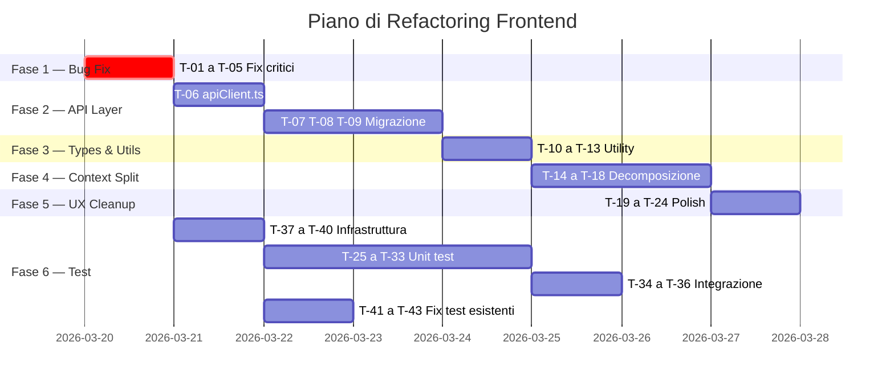

# 🏗️ Piano di Refactoring Frontend — Nispa VibeVoice Studio

> Analisi completa del codebase frontend con identificazione di bug, flaw architetturali, code smell e piano di test.  
> Data analisi: 19 Marzo 2026

---

## 📊 Panoramica del Codebase

| Metrica | Valore |
|---------|--------|
| Framework | React 19 + Vite 7 + TypeScript 5.9 |
| Styling | Tailwind CSS v4 |
| Test Runner | Vitest 4 + Testing Library |
| File sorgente (`.tsx`/`.ts`) | ~50 file |
| File di test esistenti | 12 |
| Context/Provider | 4 (Global, Subtitle, Translation, Script) |
| Custom Hooks | 5 (useSystemInfo, useJobArchive, useScriptGeneration, useTranslationLoop, useVoicesManagement) |
| LOC stimato (solo src/) | ~4.500 |

---

## 🐛 Bug Individuati

### BUG-01 — `useTranslationLoop`: Chiamata setState usata come argomento 🔴 CRITICO

**File:** `useTranslationLoop.ts` L111-L112

```typescript
setPreviousOriginalText(setCurrentOriginalText(lastTrans.original_text || ''));
setPreviousTranslatedText(setCurrentTranslatedText(lastTrans.text || ''));
```

**Problema:** `setCurrentOriginalText` è un setter di stato (`void`), non ritorna il valore. Viene usato come argomento di `setPreviousOriginalText`, che quindi riceve `undefined`. Bug silenzioso dove `previousOriginalText` e `previousTranslatedText` sono sempre `undefined`.

**Fix:**
```typescript
setPreviousOriginalText(lastTrans.original_text || '');
setCurrentOriginalText(lastTrans.original_text || '');
setPreviousTranslatedText(lastTrans.text || '');
setCurrentTranslatedText(lastTrans.text || '');
```

---

### BUG-02 — `GenerationControls`: `subtitleFile` usato senza null-check 🔴 CRITICO

**File:** `GenerationControls.tsx` L277

```typescript
saveJobDraft('Completed generation', subtitleSegments, subtitleFile.name);
```

`subtitleFile` è di tipo `File | null`. Dentro il callback `onmessage` dell'EventSource (asincrono), `subtitleFile` potrebbe essere diventato `null`. TypeScript non segnala l'errore perché il ref si perde nel closure.

---

### BUG-03 — `FileUploadArea`: Classi CSS Tailwind costruite dinamicamente 🟡 MEDIO

**File:** `FileUploadArea.tsx` L76-L77

```typescript
`border-${activeColorClass} ${activeBgClass}`
```

Tailwind usa tree-shaking statico: classi costruite con interpolazione di stringhe **non vengono incluse nel bundle di produzione**. Pattern fragile e anti-pattern.

---

### BUG-04 — `AudioWaveformPlayer`: Memory leak su AudioContext 🟡 MEDIO

**File:** `AudioWaveformPlayer.tsx` L71

```typescript
const audioCtx = new (window.AudioContext || (window as any).webkitAudioContext)();
```

Un nuovo `AudioContext` viene creato ad ogni click su Play senza mai essere chiuso (`audioCtx.close()`). I browser limitano il numero massimo di AudioContext attivi (~6 su Chrome). Dopo qualche play/stop, l'audio smette di funzionare.

---

### BUG-05 — `JobReviewModal`: `getActiveAudioUrl` crea blob:URL senza cleanup 🟡 MEDIO

**File:** `JobReviewModal.tsx` L77-L101

`getActiveAudioUrl` crea un nuovo `URL.createObjectURL(blob)` ogni volta che viene invocato durante il render. Visto che è chiamato nel JSX (`getActiveAudioUrl(seg)`), viene eseguito ad **ogni render** — creando blob:URL mai revocati (memory leak crescente).

---

### BUG-06 — `SubtitleContext`: Doppia instanziazione di `useJobArchive` 🟡 MEDIO

**File:** `SubtitleContext.tsx` L129 e L372

```typescript
const { saveJobDraft: saveJobAction } = useJobArchive();  // Riga 129
// ... 240 righe dopo ...
const { updateJob: updateJobAction } = useJobArchive();    // Riga 372
```

`useJobArchive()` chiamato **due volte** nello stesso componente: due istanze indipendenti con state `jobs` e `loading` separati. Spreco di risorse e possibile inconsistenza dati.

---

### BUG-07 — `useScriptGeneration.test.ts`: Variabile `TextDecoder` inutilizzata nel mock 🟢 BASSO

**File:** `useScriptGeneration.test.ts` L51

```typescript
const encoder = new TextDecoder(); // crea un TextDecoder, lo chiama "encoder", e non lo usa mai
```

Code smell nel test, non impatta la produzione.

---

## 🏛️ Flaw Architetturali

### ARCH-01 — URL API hardcoded ovunque 🔴 CRITICO PER MANUTENIBILITÀ

Le URL API sono sparse in **almeno 12 file** con uso inconsistente:

| Pattern | File |
|---------|------|
| `http://127.0.0.1:8000` | GlobalContext, useJobArchive, useSystemInfo, VoiceProcessModal, useTranslationLoop |
| `http://localhost:8000` | GenerationControls, JobReviewModal, AudioTrimmer, SubtitleContext.saveJobDraft |

**Rischio:** Cambiare porta/host richiede modifiche massive. Il mix `127.0.0.1` vs `localhost` potrebbe causare problemi CORS.

---

### ARCH-02 — SubtitleContext è un God Object (426 LOC, 40+ proprietà)

**File:** `SubtitleContext.tsx`

Il context espone **40+ proprietà** fra stato e setter, gestendo contemporaneamente:
- File management
- TTS voice/model selection
- Activity logging
- Subtitle grouping & preview
- Subtitle editing
- Job archive persistence
- Generation progress tracking
- Task cancellation

Viola il Single Responsibility Principle. Qualsiasi componente che consuma anche una sola proprietà causa un re-render globale.

---

### ARCH-03 — Logica base64→Blob ripetuta 5+ volte (DRY violation)

La logica di conversione è copia-incollata in almeno 5 punti:

```typescript
const binaryString = atob(base64String);
const bytes = new Uint8Array(binaryString.length);
for (let i = 0; i < binaryString.length; i++) {
    bytes[i] = binaryString.charCodeAt(i);
}
const blob = new Blob([bytes], { type: 'audio/wav' });
const url = URL.createObjectURL(blob);
```

**Presente in:** `useScriptGeneration.ts`, `GenerationControls.tsx` (x2), `SubtitleContext.tsx`, `JobReviewModal.tsx`

---

### ARCH-04 — Nessun layer di servizio API (fetch inline)

Tutte le chiamate `fetch()` sono inline nei componenti e hook. Non c'è un **API client** centralizzato. Questo rende impossibile:
- Aggiungere interceptor globali (auth, retry, error handling)
- Mockare le API in modo uniforme nei test
- Gestire la configurazione base URL
- Implementare caching o deduplicazione delle richieste

---

### ARCH-05 — Tipi `any` usati abbondantemente

| File | Count | Esempi |
|------|-------|--------|
| SubtitleContext.tsx | 6+ | `previewData: any`, `generatedSegments: any[]` |
| GenerationControls.tsx | 3+ | `data.new_segments.map((seg: any)` |
| TranslationControls.tsx | 1 | Non tipizzato in catch |
| useJobArchive.ts | 2 | `saveJobDraft(jobData: any)` |
| ActivityLogsModal | 1 | `generatedSegments?: any[]` |

---

### ARCH-06 — `App.css` contiene boilerplate Vite template inutilizzato

Contiene classi dalla template Vite originale (`.logo`, `.logo-spin`, `.read-the-docs`) non usate in nessun componente. Dead code.

---

### ARCH-07 — Mix di linguaggi nell'UI (IT/EN)

L'interfaccia mescola italiano e inglese:
- `GenerationControls.tsx`: "In corso..." e "Dettagli Operazione" (IT) accanto a "Generate Voice-over" (EN)
- `handleCancel`: "Vuoi scaricare l'audio generato finora..." (IT) in un file tutto in inglese
- `TranslationControls.tsx`: tutto in EN

---

### ARCH-08 — Uso di `alert()` / `confirm()` nativi

Utilizzati in **8+ punti** per feedback utente e conferme:
- `useJobArchive.ts`: L69, L143, L148, L152
- `SubtitleContext.tsx`: L260, L369
- `TranslationControls.tsx`: L57, L61, L75
- `useTranslationLoop.ts`: L140, L148

Anti-pattern: blocca il thread, non è stilizzabile, e rompe l'esperienza UX.

---

### ARCH-09 — Nessun Error Boundary

Nessun `ErrorBoundary` React nell'app. Un errore JavaScript fa crashare l'intera applicazione con schermata bianca. Pericoloso con blob audio, EventSource e AudioContext.

---

### ARCH-10 — Interfacce duplicate (`Voice`)

**File:** `VoiceProcessModal/index.tsx` L5-L9, `VoiceSelector.tsx` L3-L10

```typescript
interface Voice {
    id: string;
    name: string;
    language: string;
}
```

L'interfaccia `Voice` è già definita in `GlobalContext.tsx` con più campi. Le ridefinizioni locali sono duplicati drifting.

---

## 📋 Checklist Completa dei Task di Refactoring

### Fase 1 — Fix Bug Critici (Priorità Massima)

- [ ] **T-01** Fix `useTranslationLoop.ts` L111-112: separare le chiamate setter (BUG-01)
- [ ] **T-02** Fix `GenerationControls.tsx` L277: aggiungere null-check `subtitleFile?.name` (BUG-02)
- [ ] **T-03** Fix `AudioWaveformPlayer.tsx`: chiudere `AudioContext` nel cleanup o riutilizzarlo (BUG-04)
- [ ] **T-04** Fix `JobReviewModal.tsx`: memoizzare gli URL audio (useMemo o caching map) (BUG-05)
- [ ] **T-05** Fix `SubtitleContext.tsx`: unificare le due chiamate a `useJobArchive()` (BUG-06)

### Fase 2 — API Layer centralizzato

- [ ] **T-06** Creare `src/services/apiClient.ts` con base URL da env variable `VITE_API_BASE_URL` (ARCH-01)
- [ ] **T-07** Definire metodi tipizzati: `tts.getVoices()`, `tts.getModels()`, `jobs.create()`, `jobs.update()`, etc.
- [ ] **T-08** Migrare tutte le chiamate `fetch()` inline al nuovo API client
- [ ] **T-09** Unificare `127.0.0.1` vs `localhost` con la singola variabile d'ambiente

### Fase 3 — Utility e Tipi condivisi

- [ ] **T-10** Creare `src/utils/audio.ts` con helper `base64ToBlob()`, `base64ToBlobUrl()`, `revokeAudioUrl()` (ARCH-03)
- [ ] **T-11** Creare `src/types/` con file condivisi: `voice.ts`, `job.ts`, `segment.ts`, `model.ts` (ARCH-05, ARCH-10)
- [ ] **T-12** Sostituire tutti i `any` con tipi specifici (target: 0 `any`)
- [ ] **T-13** Creare `src/utils/format.ts` per funzioni ripetute (`formatTime`, `formatDateTime`, `formatTimeSrt`)

### Fase 4 — Decomposizione SubtitleContext (God Object)

- [ ] **T-14** Estrarre logica di generation progress in `useGenerationProgress` (ARCH-02)
- [ ] **T-15** Estrarre logica activity logs in `useActivityLogs`
- [ ] **T-16** Estrarre logica TTS voice/model in `useTtsSelection`
- [ ] **T-17** Estrarre logica job persistence in `useJobPersistence`
- [ ] **T-18** Ridurre SubtitleContext a max ~15 proprietà essenziali

### Fase 5 — UX e Cleanup

- [ ] **T-19** Creare `ConfirmDialog` modale, sostituire tutti gli `alert()` / `confirm()` (ARCH-08)
- [ ] **T-20** Aggiungere `ErrorBoundary` wrapper in `App.tsx` (ARCH-09)
- [ ] **T-21** Rimuovere `App.css` dead code (ARCH-06)
- [ ] **T-22** Standardizzare la lingua dell'UI (ARCH-07)
- [ ] **T-23** Fix `FileUploadArea.tsx`: classi complete come props invece di composizione dinamica (BUG-03)
- [ ] **T-24** Rimuovere cartella vuota `src/features/script/components/ScriptMode/`

### Fase 6 — Piano Test

#### 6A — Test Unitari Mancanti

- [ ] **T-25** Test `SubtitleContext`: inizializzazione, `loadJobSegments`, `saveJobDraft`, `cancelGeneration`
- [ ] **T-26** Test `TranslationContext`: inizializzazione, `refreshOllamaModels`
- [ ] **T-27** Test `GenerationControls`: flusso `handleGenerate`, EventSource mock, `handleCancel`
- [ ] **T-28** Test `JobReviewModal`: `handleRegenerate`, `handleFinalize`, `handleTrimmed`, paginazione
- [ ] **T-29** Test `TranslationControls`: `handleStartTranslation`, `handleClearTranslation`
- [ ] **T-30** Test `AudioTrimmer`: `performTrim`, play preview, reset range
- [ ] **T-31** Test `FileUploadArea`: drag-and-drop, file type validation, click upload
- [ ] **T-32** Test `JobArchivePanel`: search, toggle expand, integration con `useJobArchive`
- [ ] **T-33** Test `JobTableRow`: render condizionale badge (AUDIO SAVED, TRANSLATED, GROUPED)

#### 6B — Test di Integrazione

- [ ] **T-34** Test integrazione: flusso completo upload subtitle → grouping → translation → generation
- [ ] **T-35** Test integrazione: flusso caricamento job → review → regenerate → finalize
- [ ] **T-36** Test integrazione: Script mode end-to-end

#### 6C — Test Infrastruttura

- [ ] **T-37** Aggiungere `src/test-utils/` con `renderWithProviders()` helper
- [ ] **T-38** Mock centralizzato per `fetch` con risposte predefinite
- [ ] **T-39** Mock per `AudioContext`, `URL.createObjectURL`, `EventSource`
- [ ] **T-40** Aggiungere copertura code coverage nel report vitest

#### 6D — Miglioramento Test Esistenti

- [ ] **T-41** Fix `useScriptGeneration.test.ts`: rimuovere `TextDecoder` inutilizzata (BUG-07)
- [ ] **T-42** Test per errori di rete/timeout in `useJobArchive.test.ts`
- [ ] **T-43** Test per meccanismo di pausa in `useTranslationLoop.test.ts`

---

## 📁 Struttura Post-Refactoring Proposta

```
src/
├── App.tsx
├── main.tsx
├── index.css
│
├── types/                     # 🆕 Tipi condivisi
│   ├── voice.ts
│   ├── model.ts
│   ├── job.ts
│   └── segment.ts
│
├── services/                  # 🆕 API Layer
│   ├── apiClient.ts           #    Base fetch wrapper con interceptor
│   ├── ttsApi.ts              #    Voices, Models, Generation
│   ├── jobsApi.ts             #    CRUD Jobs
│   ├── translationApi.ts      #    Translation batch
│   └── systemApi.ts           #    System info, status, trim-audio
│
├── utils/                     # 🆕 Utility pure
│   ├── audio.ts               #    base64ToBlob, createAudioUrl, revokeUrl
│   └── format.ts              #    formatTime, formatTimeSrt, formatDateTime
│
├── components/
│   ├── ui/                    #    Componenti UI generici (invariato)
│   │   ├── ConfirmDialog.tsx  # 🆕 Sostituto di alert/confirm
│   │   └── ErrorBoundary.tsx  # 🆕 Error boundary globale
│   ├── ...
│
├── features/
│   ├── subtitle/
│   │   ├── hooks/
│   │   │   ├── useTranslationLoop.ts
│   │   │   ├── useGenerationProgress.ts  # 🆕 Estratto da SubtitleContext
│   │   │   ├── useActivityLogs.ts        # 🆕 Estratto da SubtitleContext
│   │   │   └── useJobPersistence.ts      # 🆕 Estratto da SubtitleContext
│   │   └── ...
│
├── hooks/                     #    Hook globali (invariato, migliorato)
│
├── test-utils/                # 🆕 Utility di test
│   ├── renderWithProviders.tsx
│   ├── mockApi.ts
│   └── mockAudio.ts
│
└── context/                   #    Context globale (invariato)
```

---

## 🎯 Ordine di Esecuzione Consigliato



> **IMPORTANTE:** La Fase 6 (Test) può procedere **in parallelo** alle altre fasi a partire dalla Fase 1. 
> L'infrastruttura di test (T-37→T-40) dovrebbe essere il primo task dopo i bug fix.

---

## 📈 Metriche di Successo

| Metrica | Attuale | Target |
|---------|---------|--------|
| Occorrenze `any` | ~15+ | 0 |
| URL API hardcoded | ~25+ | 0 (centralizzate in 1 file) |
| `alert()`/`confirm()` nativi | ~10 | 0 |
| File di test | 12 | 25+ |
| Copertura test (stima) | ~20% | >60% |
| Props in SubtitleContext | 40+ | ~15 |
| Duplicazioni codice audio util | 5+ | 1 (centralizzato) |
| Interfacce `Voice` duplicate | 3 | 1 (condivisa) |
| Memory leak noti | 3 | 0 |
