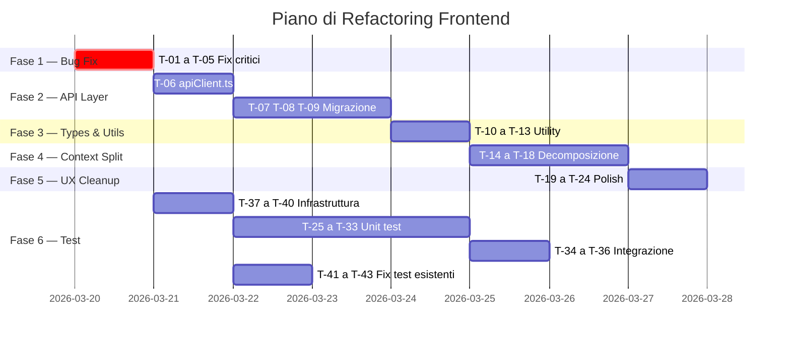

# 🏗️ Piano di Refactoring Frontend — Nispa VibeVoice Studio

> Analisi completa del codebase frontend con identificazione di bug, flaw architetturali, code smell e piano di test.  
> Data analisi: 19 Marzo 2026

---

## 📊 Panoramica del Codebase

| Metrica | Valore |
|---------|--------|
| Framework | React 19 + Vite 7 + TypeScript 5.9 |
| Styling | Tailwind CSS v4 |
| Test Runner | Vitest 4 + Testing Library |
| File sorgente ([.tsx](file:///f:/nispa-voiceover/frontend/src/App.tsx)/[.ts](file:///f:/nispa-voiceover/frontend/vite.config.ts)) | ~50 file |
| File di test esistenti | 12 |
| Context/Provider | 4 (Global, Subtitle, Translation, Script) |
| Custom Hooks | 5 (useSystemInfo, useJobArchive, useScriptGeneration, useTranslationLoop, useVoicesManagement) |
| LOC stimato (solo src/) | ~4.500 |

---

## 🐛 Bug e Flaw Critici Individuati

### BUG-01 — [useTranslationLoop](file:///f:/nispa-voiceover/frontend/src/features/subtitle/hooks/useTranslationLoop.ts#4-154): Chiamata setState usata come argomento 🔴 CRITICO

```carousel
**File:** [useTranslationLoop.ts](file:///f:/nispa-voiceover/frontend/src/features/subtitle/hooks/useTranslationLoop.ts#L111-L112)

**Codice:**
```typescript
setPreviousOriginalText(setCurrentOriginalText(lastTrans.original_text || ''));
setPreviousTranslatedText(setCurrentTranslatedText(lastTrans.text || ''));
```

**Problema:** `setCurrentOriginalText` è un setter di stato (`void`), non ritorna il valore. Viene usato come argomento di `setPreviousOriginalText`, che quindi riceve `undefined`. Questo causa un bug silenzioso dove `previousOriginalText` e `previousTranslatedText` sono sempre `undefined`.
<!-- slide -->
**Fix corretto:**
```typescript
setPreviousOriginalText(lastTrans.original_text || '');
setCurrentOriginalText(lastTrans.original_text || '');
setPreviousTranslatedText(lastTrans.text || '');
setCurrentTranslatedText(lastTrans.text || '');
```
````

---

### BUG-02 — [GenerationControls](file:///f:/nispa-voiceover/frontend/src/features/subtitle/components/GenerationControls.tsx#10-463): `subtitleFile` usato senza null-check 🔴 CRITICO

**File:** [GenerationControls.tsx](file:///f:/nispa-voiceover/frontend/src/features/subtitle/components/GenerationControls.tsx#L277)

```typescript
saveJobDraft('Completed generation', subtitleSegments, subtitleFile.name);
```

`subtitleFile` è di tipo `File | null`. Questa riga è dentro il callback [onmessage](file:///f:/nispa-voiceover/frontend/src/features/subtitle/components/GenerationControls.tsx#175-295) dell'EventSource, che è asincrono — nel frattempo `subtitleFile` potrebbe essere diventato `null`. TypeScript non segnala l'errore perché il ref si perde nel closure.

---

### BUG-03 — [FileUploadArea](file:///f:/nispa-voiceover/frontend/src/components/ui/FileUploadArea.tsx#21-122): Classi CSS Tailwind costruite dinamicamente 🟡 MEDIO

**File:** [FileUploadArea.tsx](file:///f:/nispa-voiceover/frontend/src/components/ui/FileUploadArea.tsx#L76-L77)

```typescript
`border-${activeColorClass} ${activeBgClass}`
```

Tailwind usa tree-shaking statico: classi costruite con interpolazione di stringhe (es. `` `border-${activeColorClass}` ``) **non vengono incluse nel bundle di produzione**. Funziona in dev perché Tailwind v4 con il plugin Vite genera tutto on-the-fly, ma è un pattern fragile e anti-pattern. Se si passa alla build di produzione con purge, i colori del bordo scompariranno.

---

### BUG-04 — [AudioWaveformPlayer](file:///f:/nispa-voiceover/frontend/src/components/ui/AudioWaveformPlayer.tsx#12-217): Memory leak su AudioContext 🟡 MEDIO

**File:** [AudioWaveformPlayer.tsx](file:///f:/nispa-voiceover/frontend/src/components/ui/AudioWaveformPlayer.tsx#L71)

```typescript
const audioCtx = new (window.AudioContext || (window as any).webkitAudioContext)();
```

Un nuovo `AudioContext` viene creato ad ogni click su Play senza mai essere chiuso (`audioCtx.close()`). I browser limitano il numero massimo di AudioContext attivi (~6 su Chrome). Dopo qualche play/stop su segmenti diversi, l'utente potrebbe ricevere errori silenziosi e l'audio smetterebbe di funzionare.

---

### BUG-05 — [JobReviewModal](file:///f:/nispa-voiceover/frontend/src/features/subtitle/components/JobReviewModal.tsx#17-429): [getActiveAudioUrl](file:///f:/nispa-voiceover/frontend/src/features/subtitle/components/JobReviewModal.tsx#76-102) crea blob:URL senza cleanup 🟡 MEDIO

**File:** [JobReviewModal.tsx](file:///f:/nispa-voiceover/frontend/src/features/subtitle/components/JobReviewModal.tsx#L77-L101)

[getActiveAudioUrl](file:///f:/nispa-voiceover/frontend/src/features/subtitle/components/JobReviewModal.tsx#76-102) crea un nuovo `URL.createObjectURL(blob)` ogni volta che viene invocato durante il render. Visto che è chiamato nel JSX ([getActiveAudioUrl(seg)](file:///f:/nispa-voiceover/frontend/src/features/subtitle/components/JobReviewModal.tsx#76-102)), viene eseguito ad **ogni render** — creando blob:URL mai revocati (memory leak crescente).

---

### BUG-06 — [SubtitleContext](file:///f:/nispa-voiceover/frontend/src/features/subtitle/context/SubtitleContext.tsx#413-426): Doppia instanziazione di [useJobArchive](file:///f:/nispa-voiceover/frontend/src/hooks/useJobArchive.ts#34-197) 🟡 MEDIO

**File:** [SubtitleContext.tsx](file:///f:/nispa-voiceover/frontend/src/features/subtitle/context/SubtitleContext.tsx#L129-L372)

```typescript
const { saveJobDraft: saveJobAction } = useJobArchive();  // Riga 129
// ... 240 righe dopo ...
const { updateJob: updateJobAction } = useJobArchive();    // Riga 372
```

[useJobArchive()](file:///f:/nispa-voiceover/frontend/src/hooks/useJobArchive.ts#34-197) viene chiamato **due volte** nello stesso componente, creando due istanze indipendenti del hook (con due state `jobs` e `loading` separati). Questo è uno spreco di risorse e potrebbe causare inconsistenze nei dati perché le due istanze non condividono lo stesso state.

---

### BUG-07 — [useScriptGeneration.test.ts](file:///f:/nispa-voiceover/frontend/src/hooks/useScriptGeneration.test.ts): Variabile `TextDecoder` inutilizzata nel mock 🟢 BASSO

**File:** [useScriptGeneration.test.ts](file:///f:/nispa-voiceover/frontend/src/hooks/useScriptGeneration.test.ts#L51)

```typescript
const encoder = new TextDecoder(); // crea un TextDecoder, lo chiama "encoder", e non lo usa mai
```

Solo un code smell nel test, non impatta la produzione.

---

## 🏛️ Flaw Architetturali

### ARCH-01 — URL API hardcoded ovunque 🔴 CRITICO PER MANUTENIBILITÀ

Le URL API (`http://127.0.0.1:8000/api/...` e `http://localhost:8000/api/...`) sono sparse in **almeno 12 file** differenti. Inoltre si usa **inconsistentemente** `127.0.0.1` e `localhost`:

| Pattern | File |
|---------|------|
| `http://127.0.0.1:8000` | GlobalContext, useJobArchive, useSystemInfo, VoiceProcessModal, useTranslationLoop |
| `http://localhost:8000` | GenerationControls, JobReviewModal, AudioTrimmer, SubtitleContext.saveJobDraft |

**Rischio:** Se bisogna cambiare porta, host, o aggiungere un proxy, occorre modificare decine di file. Il mix `127.0.0.1` vs `localhost` potrebbe anche causare problemi CORS in scenari edge.

---

### ARCH-02 — SubtitleContext è un God Object (426 LOC, 40+ proprietà)

**File:** [SubtitleContext.tsx](file:///f:/nispa-voiceover/frontend/src/features/subtitle/context/SubtitleContext.tsx)

Il context espone **40+ proprietà** fra stato e setter, gestendo contemporaneamente:
- File management
- TTS voice/model selection
- Activity logging
- Subtitle grouping & preview
- Subtitle editing
- Job archive persistence
- Generation progress tracking
- Task cancellation

Questo viola il Single Responsibility Principle e rende il context impossibile da testare unitariamente. Qualsiasi componente che consuma anche una sola proprietà causa un re-render globale.

---

### ARCH-03 — Logica base64→Blob ripetuta 5+ volte (DRY violation)

La seguente logica di conversione base64→Blob+URL è copia-incollata in almeno 5 punti:

```typescript
const binaryString = atob(base64String);
const bytes = new Uint8Array(binaryString.length);
for (let i = 0; i < binaryString.length; i++) {
    bytes[i] = binaryString.charCodeAt(i);
}
const blob = new Blob([bytes], { type: 'audio/wav' });
const url = URL.createObjectURL(blob);
```

**Presente in:** [useScriptGeneration.ts](file:///f:/nispa-voiceover/frontend/src/hooks/useScriptGeneration.ts) (L50-56), [GenerationControls.tsx](file:///f:/nispa-voiceover/frontend/src/features/subtitle/components/GenerationControls.tsx) (L184-190, L261-266), [SubtitleContext.tsx](file:///f:/nispa-voiceover/frontend/src/features/subtitle/context/SubtitleContext.tsx) (L333-339), [JobReviewModal.tsx](file:///f:/nispa-voiceover/frontend/src/features/subtitle/components/JobReviewModal.tsx) (L88-94)

---

### ARCH-04 — Nessun layer di servizio API (fetch inline)

Tutte le chiamate `fetch()` sono inline nei componenti e hook. Non c'è un **API client** centralizzato. Questo rende impossibile:
- Aggiungere interceptor globali (auth, retry, error handling)
- Mockare le API in modo uniforme nei test
- Gestire la configurazione base URL
- Implementare caching o deduplicazione delle richieste

---

### ARCH-05 — Tipi `any` usati abbondantemente

Conteggio dei `any` espliciti nel codice:

| File | Count | Esempi |
|------|-------|--------|
| SubtitleContext.tsx | 6+ | `previewData: any`, `generatedSegments: any[]`, [saveJobDraft(...): any](file:///f:/nispa-voiceover/frontend/src/features/subtitle/context/SubtitleContext.tsx#231-316) |
| GenerationControls.tsx | 3+ | `data.new_segments.map((seg: any)`, [setSubtitleSegments((prev: any[])](file:///f:/nispa-voiceover/frontend/src/features/subtitle/context/SubtitleContext.tsx#156-168) |
| TranslationControls.tsx | 1 | Non tipizzato in catch |
| useJobArchive.ts | 2 | [saveJobDraft(jobData: any)](file:///f:/nispa-voiceover/frontend/src/features/subtitle/context/SubtitleContext.tsx#231-316), [updateJob(jobId, updateData: any)](file:///f:/nispa-voiceover/frontend/src/features/subtitle/context/SubtitleContext.tsx#374-377) |
| ActivityLogsModal | 1 | `generatedSegments?: any[]` |

---

### ARCH-06 — [App.css](file:///f:/nispa-voiceover/frontend/src/App.css) contiene boilerplate Vite template inutilizzato

**File:** [App.css](file:///f:/nispa-voiceover/frontend/src/App.css)

Contiene classi dalla template Vite originale (`.logo`, `.logo-spin`, `.read-the-docs`) che non sono usate in nessun componente. Dead code.

---

### ARCH-07 — Mix di linguaggi nell'UI (IT/EN)

L'interfaccia mescola italiano e inglese:
- [GenerationControls.tsx](file:///f:/nispa-voiceover/frontend/src/features/subtitle/components/GenerationControls.tsx): "In corso..." e "Dettagli Operazione" (IT) accanto a "Generate Voice-over" (EN)
- [handleCancel](file:///f:/nispa-voiceover/frontend/src/features/subtitle/components/GenerationControls.tsx#312-348): "Vuoi scaricare l'audio generato finora..." (IT) in un file tutto in inglese
- [TranslationControls.tsx](file:///f:/nispa-voiceover/frontend/src/features/subtitle/components/TranslationControls.tsx): tutto in EN

---

### ARCH-08 — Uso di `alert()` / `confirm()` nativi

Il pattern `alert()` / `confirm()` del browser viene usato in **8+ punti** per feedback utente e conferme:
- [useJobArchive.ts](file:///f:/nispa-voiceover/frontend/src/hooks/useJobArchive.ts): L69, L143, L148, L152
- [SubtitleContext.tsx](file:///f:/nispa-voiceover/frontend/src/features/subtitle/context/SubtitleContext.tsx): L260, L369
- [TranslationControls.tsx](file:///f:/nispa-voiceover/frontend/src/features/subtitle/components/TranslationControls.tsx): L57, L61, L75
- [useTranslationLoop.ts](file:///f:/nispa-voiceover/frontend/src/features/subtitle/hooks/useTranslationLoop.ts): L140, L148

Questo è anti-pattern per un'app professionale: blocca il thread, non è stilizzabile, e rompe l'esperienza UX.

---

### ARCH-09 — Nessun Error Boundary

Non c'è nessun `ErrorBoundary` React nell'app. Un errore JavaScript in qualsiasi componente fa crashare l'intera applicazione con una schermata bianca. Particolarmente pericoloso dato che il codebase manipola blob audio, EventSource, e AudioContext che possono generare eccezioni imprevedibili.

---

### ARCH-10 — [VoiceProcessModal/index.tsx](file:///f:/nispa-voiceover/frontend/src/components/VoiceProcessModal/index.tsx) ridefinisce l'interfaccia [Voice](file:///f:/nispa-voiceover/frontend/src/components/ui/VoiceSelector.tsx#3-11) localmente

**File:** [VoiceProcessModal/index.tsx](file:///f:/nispa-voiceover/frontend/src/components/VoiceProcessModal/index.tsx#L5-L9)

```typescript
interface Voice {
    id: string;
    name: string;
    language: string;
}
```

L'interfaccia [Voice](file:///f:/nispa-voiceover/frontend/src/components/ui/VoiceSelector.tsx#3-11) è già definita in [GlobalContext.tsx](file:///f:/nispa-voiceover/frontend/src/context/GlobalContext.tsx) con più campi. La ridefinizione locale è un duplicato drifting — se si aggiunge un campo globale, questo componente non lo vedrà.

Lo stesso vale per [VoiceSelector.tsx](file:///f:/nispa-voiceover/frontend/src/components/ui/VoiceSelector.tsx) (L3-L10) che ridefinisce [Voice](file:///f:/nispa-voiceover/frontend/src/components/ui/VoiceSelector.tsx#3-11) localmente.

---

## 📋 Checklist Completa dei Task di Refactoring

### Fase 1 — Fix Bug Critici (Priorità Massima)

- [ ] **T-01** Fix [useTranslationLoop.ts](file:///f:/nispa-voiceover/frontend/src/features/subtitle/hooks/useTranslationLoop.ts) L111-112: separare le chiamate `setPreviousOriginalText` / `setCurrentOriginalText` ([BUG-01](#bug-01--usetranslationloop-chiamata-setstate-usata-come-argomento--critico))
- [ ] **T-02** Fix [GenerationControls.tsx](file:///f:/nispa-voiceover/frontend/src/features/subtitle/components/GenerationControls.tsx) L277: aggiungere null-check `subtitleFile?.name` ([BUG-02](#bug-02--generationcontrols-subtitlefile-usato-senza-null-check--critico))
- [ ] **T-03** Fix [AudioWaveformPlayer.tsx](file:///f:/nispa-voiceover/frontend/src/components/ui/AudioWaveformPlayer.tsx): chiudere `AudioContext` nel cleanup del componente o riutilizzarlo ([BUG-04](#bug-04--audiowaveformplayer-memory-leak-su-audiocontext--medio))
- [ ] **T-04** Fix [JobReviewModal.tsx](file:///f:/nispa-voiceover/frontend/src/features/subtitle/components/JobReviewModal.tsx): memoizzare gli URL audio (useMemo o caching map) per evitare leak di blob:URL ([BUG-05](#bug-05--jobreviewmodal-getactiveaudiourl-crea-bloburl-senza-cleanup--medio))
- [ ] **T-05** Fix [SubtitleContext.tsx](file:///f:/nispa-voiceover/frontend/src/features/subtitle/context/SubtitleContext.tsx): unificare le due chiamate a [useJobArchive()](file:///f:/nispa-voiceover/frontend/src/hooks/useJobArchive.ts#34-197) in una singola ([BUG-06](#bug-06--subtitlecontext-doppia-instanziazione-di-usejobarchive--medio))

### Fase 2 — API Layer centralizzato

- [ ] **T-06** Creare file `src/services/apiClient.ts` con base URL configurabile da env variable (`VITE_API_BASE_URL`) ([ARCH-01](#arch-01--url-api-hardcoded-ovunque--critico-per-manutenibilità))
- [ ] **T-07** Definire metodi tipizzati per ogni endpoint: `tts.getVoices()`, `tts.getModels()`, `jobs.create()`, `jobs.update()`, `tasks.generate()`, etc.
- [ ] **T-08** Migrare tutte le chiamate `fetch()` inline nei componenti/hooks al nuovo API client
- [ ] **T-09** Unificare l'uso di `127.0.0.1` vs `localhost` con la singola variabile d'ambiente

### Fase 3 — Utility e Tipi condivisi

- [ ] **T-10** Creare `src/utils/audio.ts` con helper `base64ToBlob()`, `base64ToBlobUrl()`, `revokeAudioUrl()` ([ARCH-03](#arch-03--logica-base64blob-ripetuta-5-volte-dry-violation))
- [ ] **T-11** Creare `src/types/` con file condivisi: `voice.ts`, `job.ts`, `segment.ts`, `model.ts` — eliminare tutte le interfacce duplicate ([ARCH-05](#arch-05--tipi-any-usati-abbondantemente), [ARCH-10](#arch-10--voiceprocessmodalindextsx-ridefinisce-linterfaccia-voice-localmente))
- [ ] **T-12** Sostituire tutti i `any` con tipi specifici (target: 0 `any` nel codebase)
- [ ] **T-13** Creare `src/utils/format.ts` per le funzioni di formattazione ripetute ([formatTime](file:///f:/nispa-voiceover/frontend/src/components/archive/JobTableRow.tsx#20-27), [formatDateTime](file:///f:/nispa-voiceover/frontend/src/components/archive/JobTableRow.tsx#15-19), [formatTimeSrt](file:///f:/nispa-voiceover/frontend/src/hooks/useJobArchive.ts#94-105))

### Fase 4 — Decomposizione SubtitleContext (God Object)

- [ ] **T-14** Estrarre logica di generation progress in un nuovo hook `useGenerationProgress` ([ARCH-02](#arch-02--subtitlecontext-è-un-god-object-426-loc-40-proprietà))
- [ ] **T-15** Estrarre logica activity logs in un nuovo hook `useActivityLogs`
- [ ] **T-16** Estrarre logica TTS voice/model selection in un hook riutilizzabile `useTtsSelection`
- [ ] **T-17** Estrarre logica di job persistence (save/update/load) in un hook `useJobPersistence`
- [ ] **T-18** Ridurre SubtitleContext a max ~15 proprietà essenziali, delegando il resto ai sotto-hook

### Fase 5 — UX e Cleanup

- [ ] **T-19** Creare un componente `ConfirmDialog` modale personalizzato, sostituire tutti gli `alert()` / `confirm()` ([ARCH-08](#arch-08--uso-di-alert--confirm-nativi))
- [ ] **T-20** Aggiungere un `ErrorBoundary` wrapper in [App.tsx](file:///f:/nispa-voiceover/frontend/src/App.tsx) con fallback UI di errore ([ARCH-09](#arch-09--nessun-error-boundary))
- [ ] **T-21** Rimuovere [App.css](file:///f:/nispa-voiceover/frontend/src/App.css) (dead code dalla template Vite) ([ARCH-06](#arch-06--appcss-contiene-boilerplate-vite-template-inutilizzato))
- [ ] **T-22** Standardizzare la lingua dell'UI (scegliere EN o IT per tutto) ([ARCH-07](#arch-07--mix-di-linguaggi-nellui-iten))
- [ ] **T-23** Fix [FileUploadArea.tsx](file:///f:/nispa-voiceover/frontend/src/components/ui/FileUploadArea.tsx): passare le classi complete come props invece di comporre dinamicamente nomi Tailwind ([BUG-03](#bug-03--fileuploadarea-classi-css-tailwind-costruite-dinamicamente--medio))
- [ ] **T-24** Rimuovere cartella vuota `src/features/script/components/ScriptMode/`

### Fase 6 — Piano Test

#### 6A — Test Unitari Mancanti (target: copertura critica)

- [ ] **T-25** Test per [SubtitleContext](file:///f:/nispa-voiceover/frontend/src/features/subtitle/context/SubtitleContext.tsx#413-426): inizializzazione, [loadJobSegments](file:///f:/nispa-voiceover/frontend/src/features/subtitle/context/SubtitleContext.tsx#317-371), [saveJobDraft](file:///f:/nispa-voiceover/frontend/src/features/subtitle/context/SubtitleContext.tsx#231-316), [cancelGeneration](file:///f:/nispa-voiceover/frontend/src/features/subtitle/context/SubtitleContext.tsx#203-230)
- [ ] **T-26** Test per [TranslationContext](file:///f:/nispa-voiceover/frontend/src/features/subtitle/context/TranslationContext.tsx#129-142): inizializzazione, [refreshOllamaModels](file:///f:/nispa-voiceover/frontend/src/features/subtitle/context/TranslationContext.tsx#80-100)
- [ ] **T-27** Test per [GenerationControls](file:///f:/nispa-voiceover/frontend/src/features/subtitle/components/GenerationControls.tsx#10-463): flusso [handleGenerate](file:///f:/nispa-voiceover/frontend/src/hooks/useScriptGeneration.ts#68-192), EventSource mock, [handleCancel](file:///f:/nispa-voiceover/frontend/src/features/subtitle/components/GenerationControls.tsx#312-348)
- [ ] **T-28** Test per [JobReviewModal](file:///f:/nispa-voiceover/frontend/src/features/subtitle/components/JobReviewModal.tsx#17-429): [handleRegenerate](file:///f:/nispa-voiceover/frontend/src/features/subtitle/components/JobReviewModal.tsx#103-169), [handleFinalize](file:///f:/nispa-voiceover/frontend/src/features/subtitle/components/JobReviewModal.tsx#170-203), [handleTrimmed](file:///f:/nispa-voiceover/frontend/src/features/subtitle/components/JobReviewModal.tsx#38-57), paginazione
- [ ] **T-29** Test per [TranslationControls](file:///f:/nispa-voiceover/frontend/src/features/subtitle/components/TranslationControls.tsx#8-285): [handleStartTranslation](file:///f:/nispa-voiceover/frontend/src/features/subtitle/components/TranslationControls.tsx#53-68), [handleClearTranslation](file:///f:/nispa-voiceover/frontend/src/features/subtitle/components/TranslationControls.tsx#74-85), [handleSaveTranslatedDraft](file:///f:/nispa-voiceover/frontend/src/features/subtitle/components/TranslationControls.tsx#86-105)
- [ ] **T-30** Test per [AudioTrimmer](file:///f:/nispa-voiceover/frontend/src/components/ui/AudioTrimmer.tsx#10-190): [performTrim](file:///f:/nispa-voiceover/frontend/src/components/ui/AudioTrimmer.tsx#57-99), play preview, reset range
- [ ] **T-31** Test per [FileUploadArea](file:///f:/nispa-voiceover/frontend/src/components/ui/FileUploadArea.tsx#21-122): drag-and-drop, file type validation, click upload
- [ ] **T-32** Test per [JobArchivePanel](file:///f:/nispa-voiceover/frontend/src/components/JobArchivePanel.tsx#11-89): search, toggle expand, integration con [useJobArchive](file:///f:/nispa-voiceover/frontend/src/hooks/useJobArchive.ts#34-197)
- [ ] **T-33** Test per [JobTableRow](file:///f:/nispa-voiceover/frontend/src/components/archive/JobTableRow.tsx#43-195): render condizionale badge (AUDIO SAVED, TRANSLATED, GROUPED)

#### 6B — Test di Integrazione

- [ ] **T-34** Test integrazione: flusso completo upload subtitle → grouping → translation → generation
- [ ] **T-35** Test integrazione: flusso caricamento job dall'archivio → review → regenerate segmento → finalize
- [ ] **T-36** Test integrazione: Script mode end-to-end (input → speaker detection → voice mapping → generate)

#### 6C — Test Infrastruttura

- [ ] **T-37** Aggiungere `src/test-utils/` con `renderWithProviders()` helper che wrappa componenti in tutti i Provider necessari
- [ ] **T-38** Aggiungere mock centralizzato per `fetch` con risposte predefinite per ogni endpoint API
- [ ] **T-39** Aggiungere mock per `AudioContext`, `URL.createObjectURL`, `EventSource`
- [ ] **T-40** Aggiungere copertura code coverage nel report vitest (`vitest.config.ts → coverage`)

#### 6D — Miglioramento Test Esistenti

- [ ] **T-41** Fix [useScriptGeneration.test.ts](file:///f:/nispa-voiceover/frontend/src/hooks/useScriptGeneration.test.ts): rimuovere variabile `TextDecoder` inutilizzata nel mock ([BUG-07](#bug-07--usescriptgenerationtestts-variabile-textdecoder-inutilizzata-nel-mock--basso))
- [ ] **T-42** Aggiungere test per errori di rete/timeout in [useJobArchive.test.ts](file:///f:/nispa-voiceover/frontend/src/hooks/useJobArchive.test.ts)
- [ ] **T-43** Aggiungere test per il meccanismo di pausa in [useTranslationLoop.test.ts](file:///f:/nispa-voiceover/frontend/src/features/subtitle/hooks/useTranslationLoop.test.ts)

---

## 📁 Struttura Post-Refactoring Proposta

```
src/
├── App.tsx
├── main.tsx
├── index.css
│
├── types/                     # 🆕 Tipi condivisi
│   ├── voice.ts
│   ├── model.ts
│   ├── job.ts
│   └── segment.ts
│
├── services/                  # 🆕 API Layer
│   ├── apiClient.ts           #    Base fetch wrapper con interceptor
│   ├── ttsApi.ts              #    Voices, Models, Generation
│   ├── jobsApi.ts             #    CRUD Jobs
│   ├── translationApi.ts      #    Translation batch
│   └── systemApi.ts           #    System info, status, trim-audio
│
├── utils/                     # 🆕 Utility pure
│   ├── audio.ts               #    base64ToBlob, createAudioUrl, revokeUrl
│   └── format.ts              #    formatTime, formatTimeSrt, formatDateTime
│
├── components/
│   ├── ui/                    #    Componenti UI generici (invariato)
│   │   ├── ConfirmDialog.tsx   # 🆕 Sostituto di alert/confirm
│   │   └── ErrorBoundary.tsx   # 🆕 Error boundary globale
│   ├── ...
│
├── features/
│   ├── subtitle/
│   │   ├── hooks/
│   │   │   ├── useTranslationLoop.ts
│   │   │   ├── useGenerationProgress.ts  # 🆕 Estratto da SubtitleContext
│   │   │   ├── useActivityLogs.ts        # 🆕 Estratto da SubtitleContext
│   │   │   └── useJobPersistence.ts      # 🆕 Estratto da SubtitleContext
│   │   └── ...
│
├── hooks/                     #    Hook globali (invariato, migliorato)
│
├── test-utils/                # 🆕 Utility di test
│   ├── renderWithProviders.tsx
│   ├── mockApi.ts
│   └── mockAudio.ts
│
└── context/                   #    Context globale (invariato)
```

---

## 🎯 Ordine di Esecuzione Consigliato



> [!IMPORTANT]
> La Fase 6 (Test) può procedere **in parallelo** alle altre fasi a partire dalla Fase 1. 
> L'infrastruttura di test (T-37→T-40) dovrebbe essere il primo task dopo i bug fix.

---

## 📈 Metriche di Successo

| Metrica | Attuale | Target |
|---------|---------|--------|
| Occorrenze `any` | ~15+ | 0 |
| URL API hardcoded | ~25+ | 0 (centralizzate in 1 file) |
| `alert()`/`confirm()` nativi | ~10 | 0 |
| File di test | 12 | 25+ |
| Copertura test (stima) | ~20% | >60% |
| Props in SubtitleContext | 40+ | ~15 |
| Duplicazioni codice audio util | 5+ | 1 (centralizzato) |
| Interfacce [Voice](file:///f:/nispa-voiceover/frontend/src/components/ui/VoiceSelector.tsx#3-11) duplicate | 3 | 1 (condivisa) |
| Memory leak noti | 3 | 0 |
